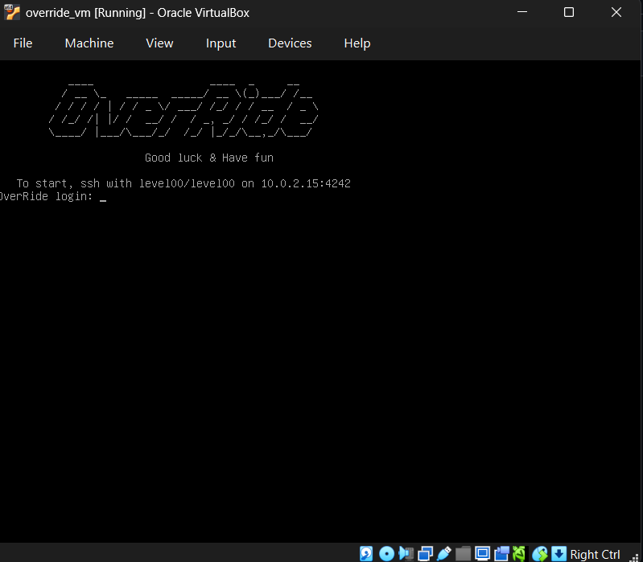
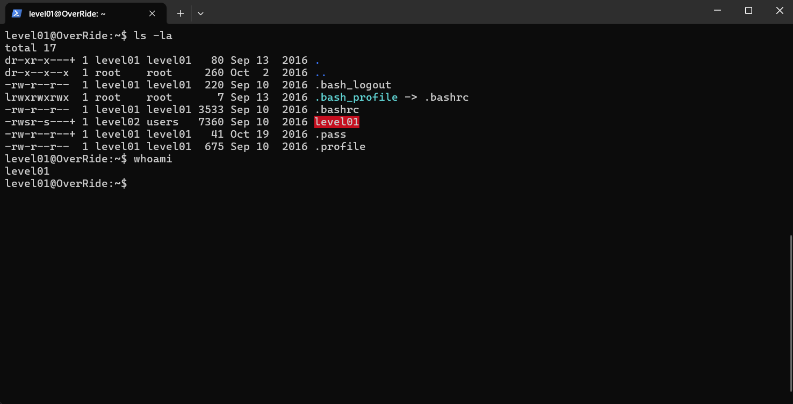
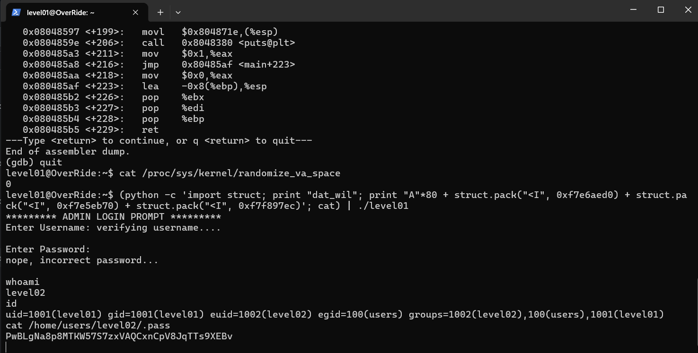

# Override
Reverse engineering via memory-corruption project in 42's advanced curriculum - aka "Segmentation fault, but make it productive"

_Co-created with @HaruSnak_

## So, what gets overridden?

Override picks up more or less where [Rainfall](https://github.com/tmoel1/Rainfall) leaves off: another bare-bones Linux VM, another collection of recalcitrant but ultimately exploitable binaries, and another invitation to make them do things they were very much not designed to do.

The objective remains simple enough on paper: reverse engineer each ELF binary, find the flaw, exploit it and obtain a shell as the next user. In practice, the binaries are less cooperative this time around, with more protections, more assembly to wade through and generally fewer obvious ways in.

## Same tools, sharper edges and more banging

Using GDB, objdump and Linux CLI tools, I worked through each executable at assembly level, tracing program flow and memory behaviour before building an exploit around whatever weakness was available. That meant manipulating buffer overflows, format-string vulnerabilities, shellcode, return-address manipulation and return-to-libc, while also working around protections that make the straightforward approaches increasingly unreliable.

Override essentially takes the low-level exploitation introduced in Rainfall and turns the dial up: less guessing, more understanding exactly what the CPU, stack and process are doing before trying to break them.

 

 

 

 

_All roads lead to /bin/sh, eventually_.
